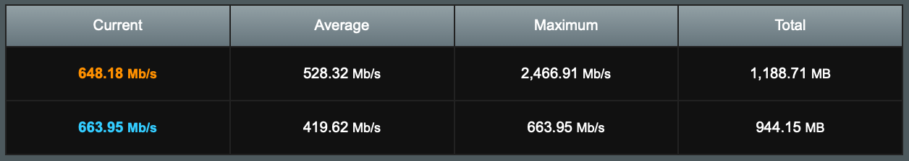

# Asuswrt‑Merlin Script Collection

A set of shell scripts that extend the functionality of routers running **[Asuswrt‑Merlin](https://www.asuswrt-merlin.net/)**.  Each script lives in `/jffs/scripts` and is wired into Merlin's built‑in hook system (*services‑start*, *nat‑start*, *wgclient‑start*, etc.).

> **Firmware requirement**: these scripts rely on Merlin's custom script framework and will **not** run on stock ASUS firmware.


## General Information & Disclaimers

* Scripts are provided **as‑is**; review code before deployment.
* Adjust IPs, subnets, labels, and vendor IDs to suit your own configuration.
If you delete a script you don't need, also remove any calls to it from the
corresponding hook or event-handler files.
* **`send_email.sh`** (used for dual WAN & startup notifications) requires that email is preconfigured in **amtm** before running these scripts.
* Tested only on official Asuswrt Dual WAN in the failover/failback mode, with an Ethernet port as the primary WAN and a USB LTE dongle as the secondary WAN. Third‑party dual WAN scripts were **not** evaluated.


## Prerequisites

1. **Flash Asuswrt‑Merlin** to your router.
2. **Enable SSH** (*Administration → System → Enable SSH = "LAN only"*) – strongly recommended to use RSA keys and a non‑default port.
3. **Enable custom scripts/configs** (*Administration → System → Enable JFFS custom scripts and configs = "Yes"*).

4. Copy the tree:

```bash
# On your machine
git clone https://github.com/kuchkovsky/asuswrt-merlin-scripts.git
```


## 1. WireGuard client port forwarding
> **Prerequisites:**
> 1. Your **AllowedIPs** in the WireGuard config should include the tunnel subnet (e.g. `10.0.0.0/24`)
> and any optional public subnets, **but not** your LAN range
> (`192.168.0.0/16`). Use
> [this tool](https://www.procustodibus.com/blog/2021/03/wireguard-allowedips-calculator/)
> to calculate only the **AllowedIPs** you really need.
> 2. Set **Inbound Firewall → Allow** for the WireGuard client; otherwise,
> services running on the router will not be reachable by other WG peers.

* **`wgc_port_forwarding.sh`** – The ASUS GUI forwards ports only to the WAN interface. **This integration adds port forwarding capability for the WireGuard client tunnel** (`wgcX`).

  * Creates a dedicated DNAT chain (`WGC1_VSERVER`).
  * Reads a simple mapping list `EXT_PORT:DST_IP:DST_PORT[:PROTO]` and installs iptables rules for both WG ingress and LAN hair‑pin.
* **Hook wiring** – runs from **`nat-start`** so rules are reapplied after every firewall reload.
* **Static route** – adds a subnet to the routing table, so your LAN devices are reachable
  inside the tunnel.

  * **`wgclient_route.sh`** – adds or removes a static route for your WireGuard client's network (e.g. `10.0.0.0/24`)
    on the `wgcN` interface. Edit the `WG_CLIENT_SUBNET` variable inside the script to match the full subnet
    from your server's configuration (see the detailed comments in the file).
  * **`wgclient-start` / `wgclient-stop`** – tiny hooks that call the helper
    with `add` or `del`, ensuring the route is present only while the client
    is up.


## 2. Dual WAN email notifications & optional LAN host blocking

* **`wan_handler.sh`** – **listens for secondary WAN up/down events, so you're notified whenever your main ISP goes down or comes back up**.
  * Sends a notification e‑mail after the router has been up ≥ 3 minutes, preventing false alerts right after power is restored, when the primary ISP link may still be coming online.
  * Optionally blocks a noisy LAN host from using the expensive secondary link, like LTE; see `util.sh`.
* **`firewall-start`** – reapplies the block if the firewall restarts while secondary WAN is active.

## 3. Early drop of bogon traffic to exposed ports

> **Prerequisites:**
> 1. Intended for use only if port forwarding is enabled – it has no effect otherwise.
> 2. WAN interface must receive a **public IP directly** (no double NAT).

* **`pf_filter.sh`** (port forward filter) – blocks spoofed or illegitimate packets targeting public services before
they hit DNAT, conntrack, or routing logic, saving CPU cycles and reducing attack surface. This script parses your
current `VSERVER` DNAT rules, extracts all destination ports exposed to the WAN, and sets up early-drop filtering
for packets from bogon (reserved/special-use) IPv4 ranges.

* **What it does:**
  * Scans `VSERVER` iptables rules to extract forwarded TCP/UDP ports.
  * Compresses consecutive ports into compact `multiport` expressions.
  * Creates an ipset (`bogon4`) with well-known bogus IPv4 prefixes (RFC 5735, 1918, 3927, 6598, etc.).
  * Creates a dedicated `raw` table chain (`VSERVER_FILTERING`) with a single `DROP` rule for packets from those IPs.
  * Installs jump rules from `raw PREROUTING` only for the exposed ports, minimizing performance impact.

* **Why it matters:**
  * Drops spoofed packets before conntrack sees them – avoids polluting the connection table.
  * Reduces attack surface from spoofed traffic targeting forwarded services like VPN, SSH, HTTP, etc.
  * Auto-adapts to port changes via ASUS GUI (runs on `firewall-start`, so it reapplies rules after firewall reloads).
  
This script is **IPv4-only**; mirror the logic with `ip6tables` and `ipset6` if you need IPv6 support.
  
## 4. Automatic USB SSD trimming & provisioning mode fix

* **Why?** ASUS routers don't enable SSD trimming by default, and most USB SSDs ship with provisioning mode **`full`** or **`partial`**. 
  When the mode is not **`unmap`**, Linux silently ignores `fstrim`, so the
  drive never learns which blocks are free. Switching the attribute to
  **`unmap`** enables proper TRIM/UNMAP and keeps write speeds consistent.
  **This integration enables full support for USB SSD trimming on ASUS routers**.

* **`ssd_provisioning_mode.sh`** – scans `/sys/devices/` for USB devices whose
  `idVendor` equals `SSD_VENDOR_ID` (default `04e8` = Samsung) and writes
  `unmap` into every `provisioning_mode` file it finds.
* **`pre-mount`** – Merlin hot-plug hook that runs the provisioning mode fix
  automatically whenever a drive with the specified label is plugged in.

* **`trim_ssd.sh`** – the core logic for the weekly cron job that executes `fstrim -v /mnt/$SSD_LABEL` and logs the result.

### Required steps – run on the router once
  **1) Identify your vendor ID and partition path**

  ```sh
  for d in /sys/block/sd*/sd*; do
    [ -f "$d/partition" ] || continue            # keep partitions only
    part=/dev/${d##*/}                           # /dev/sdXN
    p=$(readlink -f "${d%/*}/device")            # climb to USB device node
    while [ "$p" != "/" ] && [ ! -f "$p/idVendor" ]; do p=${p%/*}; done
    [ -f "$p/idVendor" ] && printf '%s -> %s (%s)\n'         "$(cat "$p/idVendor")" "$part"         "$(cat "$p/manufacturer" 2>/dev/null)"
  done | sort -u
  ```

  Sample output:

  ```
  04e8 -> /dev/sda1 (Samsung)
  0781 -> /dev/sdb1 (SanDisk)
  ```

  Take the hex ID (`04e8`) and note the correct partition.

  **2) Supply your vendor ID (only if it isn't Samsung)** 
  
  Edit **/jffs/scripts/pre-mount** (line 11) and add your own `idVendor`
as the first argument.  Leave the line untouched if you use a Samsung SSD
(`04e8`).

  ```sh
/jffs/scripts/ssd_provisioning_mode.sh 0781   # 0781 = SanDisk (example)
  ```
  **3) Label the filesystem**

Pick any label you like (e.g. `st5`, `ssd`).

  ```sh
tune2fs -L st5 /dev/sda1   # specify your label and the device partition
  ```

**4) Keep the label in sync with the *pre-mount* hook**

Open `/jffs/scripts/pre-mount` and set:

```sh
SSD_VOLUME_LABEL='st5'   # use the exact label you assigned with tune2fs
```

## 5.  Shared utility library (`util.sh`)

A helper toolkit sourced by other scripts.

* **Purpose** – factor-out common tasks: resolving hostnames, testing if an address is private,
  creating iptables rules without duplicates and avoiding attempts to delete non-existent rules,
  blocking LAN hosts accessing from accessing WAN, so each script stays short and readable.

* **Public API**

  | Function                                            | What it does                                                                                                                                                                                                                                                                                                                                                                   | Typical use-case                                                                                                                                              |
  |-----------------------------------------------------|--------------------------------------------------------------------------------------------------------------------------------------------------------------------------------------------------------------------------------------------------------------------------------------------------------------------------------------------------------------------------------|---------------------------------------------------------------------------------------------------------------------------------------------------------------|
  | `is_lan_ip <ipv4>`                                  | Returns `0` when the address is in an RFC-1918 subnet (`10.0.0.0/8`, `172.16.0.0/12`, `192.168.0.0/16`), `1` otherwise.                                                                                                                                                                                                                                                        | Quick test before you decide to apply LAN-only logic.                                                                                                         |
  | `resolve_ip <host-or-ip>`                           | Returns a single IPv4 (LAN or WAN). Accepts literal IPs, `/etc/hosts` aliases, or DNS names. Exits non-zero if nothing resolves.                                                                                                                                                                                                                                               | Turn a hostname into an address when you don't care whether it's private.                                                                                     |
  | `resolve_lan_ip <host-or-ip>`                       | Same as `resolve_ip`, but refuses to return a public IP.  Errors out if the result is not RFC-1918.                                                                                                                                                                                                                                                                            | Safely translate a hostname when the rest of your code must see a LAN address.                                                                                |
  | `ensure_fw_rule <table> <chain> [-I\|-D] <rule...>` | Idempotent firewall helper (a helper that creates `iptables` rules without duplicates and avoids attempts to delete non-existent rules): <br>  • no flag   → append rule (`-A`) if missing<br>  • `-I`      → insert rule (`-I`) at top if missing<br>  • `-D`      → delete rule (`-D`) if present<br>Guarantees the rule appears **exactly once** (or not at all, for `-D`). | All scripts use this instead of hand-rolling `iptables -C/-A/-I/-D` checks.                                                                                   |
  | `block_wan_for_host <hostname\|ip>`                 | Resolves the target to a LAN IP and inserts a `REJECT` rule into `FORWARD`, preventing that device from reaching the WAN.                                                                                                                                                                                                                                                      | • Keep a chatty device off an expensive LTE backup link. <br> •  Enforce parental controls, cutting internet access for your child's device via user scripts. |
  | `allow_wan_for_host <hostname\|ip>`                 | Resolves the target and removes the matching `REJECT` rule, restoring WAN access.                                                                                                                                                                                                                                                                                              | • Restore the device's internet access when the primary WAN is back online. <br> • Lift parental controls, re-enabling internet for your child's device.      |

These helpers are **IPv4-only**; mirror the logic with `ip6tables` if you need IPv6 support.

## 6. nextdns-cli integration for SDNs & automatic updates
> **Prerequisites:**  
> 1. SDN integration is supported only on SDN-capable router models running Asuswrt-Merlin
> 3006.\* or later. Routers without SDN ignore the dnsmasq-sdn.postconf file.  
> 2. Install and configure
> [**nextdns-cli**](https://github.com/nextdns/nextdns/wiki/AsusWRT-Merlin)
> before adding these scripts.

* **`dnsmasq-sdn.postconf`** – **enables nextdns-cli for every SDN (Self‑Defined Network)**, not just the main LAN.
* **Auto update job** – **`services-start`** adds a weekly cron entry to update the **nextdns-cli** binary.


## 7. Traffic Monitor table (Kb/s & Mb/s) patch

* **`tmcal.js.add`** – overrides a function in ASUS `tmcal.js` so the **Traffic Monitor table shows throughput in Kbps / Mbps** instead of bytes.
* **`mount_tmcal.sh`** – concatenates the stock JS file with the patch and bind‑mounts the result over `/www/tmcal.js` at boot (using **`services‑start`**).


After the `tmcal.js` overlay is mounted, the **Traffic Analyzer → Traffic Monitor table** switches from KB/s & MB/s
to Kb/s & Mb/s:




## 8. Router startup notification

* **Startup Notification** (integrated into **`services-start`**) – **sends an email 60 seconds after the router comes
  online**. Acts as an indirect power outage alert: if you receive the message
  but didn't reboot the router yourself, it means power must have dropped and
  then returned.


## Upload the updated scripts to your router

```sh
# On your machine
cd asuswrt-merlin-scripts

# WARNING: the next command overwrites any files in /jffs with the same
# names. Back up your current /jffs or copy individual files if you want to keep them.
scp -O -r jffs/* admin@<router-ip>:/jffs/

# On your router (SSH session)
chmod a+rx /jffs/scripts/*
reboot
```


## License

This project is distributed under the [GNU General Public License v3.0](https://github.com/kuchkovsky/asuswrt-merlin-scripts/blob/main/LICENSE).
