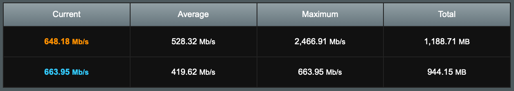

# Asuswrt‑Merlin Script Collection

A set of shell scripts that extend the functionality of routers running **[Asuswrt‑Merlin](https://www.asuswrt-merlin.net/)**.
Each script lives in `/jffs/scripts` and integrates with Merlin's built-in hook system
(`services‑start`, `nat‑start`, `wgclient‑start`, etc.).

> **Firmware requirement**: these scripts depend on Merlin's custom script framework and
  will **not** run on stock ASUS firmware.


## General Information & Disclaimers

* Scripts are provided **as‑is**; review the code before deployment.
* Adjust IPs, subnets, filesystem labels, and USB vendor IDs to match your own setup. If you remove
  a script you don't use, also delete any references to it in related hook or event-handler files.
* **`send_email.sh`** (used for Dual WAN and startup notifications) requires that email is preconfigured
  in **amtm** before running these scripts.
* Network-related scripts are IPv4-only since my ISP doesn't support IPv6 yet.
  I'll add IPv6 support once I can properly test it.


## Prerequisites

1. **Flash Asuswrt‑Merlin** to your router.
2. **Enable SSH** (*Administration → System → Enable SSH = "LAN only"*). Strongly recommended to use RSA keys
   and a non‑default port.
3. **Enable custom scripts/configs** (*Administration → System → Enable JFFS custom scripts and configs = "Yes"*).
4. **Clone the repository** to your local machine:
```bash
git clone https://github.com/kuchkovsky/asuswrt-merlin-scripts.git
```

## 1. Inbound WAN firewall

> **Prerequisites:**
> 1. Designed for use only when port forwarding is enabled - it has no effect otherwise.
> 2. The WAN interface must receive a **public IP directly** (no double NAT).
> 3. Country blocking with [GeoLite2](https://dev.maxmind.com/geoip/geolite2-free-geolocation-data/)
>    requires a `MAXMIND_LICENSE_KEY` and external USB storage; otherwise,
>    [IPdeny](https://www.ipdeny.com/ipblocks/) will be used.
> 4. The CIDR aggregation feature requires external USB storage for the
>    [mapCIDR](https://github.com/projectdiscovery/mapcidr) binary;
>    otherwise, IP ranges won't be aggregated.

* [**`wan_firewall.sh`**](jffs/scripts/firewall/wan_firewall.sh) - **high-performance inbound firewall for Asuswrt-Merlin**
  that applies only the TCP/UDP ports you actually forward in the GUI. It provides **country blocking,
  malicious IP filtering, spoofed traffic protection, and optional per-IP/per-port DoS rate limiting**
  before packets hit DNAT, conntrack, or routing - protecting your public services with minimal overhead.
  
  **By default, it uses [FireHOL Level 1](https://iplists.firehol.org/?ipset=firehol_level1) as a baseline**
  against spoofed traffic and common attack sources for minimal false positives. **Includes predefined but commented-out
  rules for stronger protection** (FireHOL Level 2/3, AbuseIPDB, IPsum, etc.) that you can enable as needed.
  
  Features **ipset aggregation** using [mapCIDR](https://github.com/projectdiscovery/mapcidr) for maximum performance
  (handled by the [`ipset_builder.sh`](jffs/scripts/firewall/ipset_builder.sh) module - see details below),
  and **fully customizable rules** for the forwarded ports. An **optional killswitch** prevents your services
  from being exposed before the initial ipset build/restore completes on system boot.
  
  On download or ipset build failure, **retries via cron and sends email alerts**;
  on success, cancels retries and sends a resolution notification.

  #### Main features
  * **Bogon traffic drop**  
    - Discards spoofed traffic from reserved/unroutable IPv4 ranges (RFC 6890, 1918, 3927, 6598, etc.) before conntrack,
      saving CPU and avoiding table pollution.
  * **Country blocking with high-accuracy [GeoLite2](https://dev.maxmind.com/geoip/geolite2-free-geolocation-data/)**  
    - Uses [MaxMind's](https://www.maxmind.com/en/home) free [GeoLite2](https://dev.maxmind.com/geoip/geolite2-free-geolocation-data/)
      database (weekly updates, multi-source verification) for some of the most accurate country-to-IP mappings available.  
    - Falls back to [IPdeny](https://www.ipdeny.com/ipblocks/) feeds if you don't set a `MAXMIND_LICENSE_KEY`.  
    - Blocks entire countries from reaching your forwarded ports - useful for cutting off high-risk regions entirely.
  * **Custom ipsets for malicious source blocking**  
    - Pulls in threat intelligence feeds you choose **directly from URLs** - e.g. AbuseIPDB, IPsum, DShield, Greensnow.
      Can also use **custom hardcoded IP lists** defined directly in the configuration file.
    - Supports downloads from **any source**, including the **API key protected ones** by allowing you to specify
      custom `curl` arguments like headers, so you can integrate paid or authenticated feeds without modifying the script. 
    - Ships with [**FireHOL Level 1**](https://iplists.firehol.org/?ipset=firehol_level1) enabled as a baseline:
      curated bogon + abuse + attack source list designed for minimal false positives.  
    - Includes [predefined](jffs/scripts/firewall/config.sh) (commented out by default) high-impact feeds for stronger protection:
      * [**FireHOL Level 2**](https://iplists.firehol.org/?ipset=firehol_level2) - broader threat coverage,
        focusing on active attacks from the last ~48 hours (blocklist_de, dshield_1d, greensnow).  
      * [**FireHOL Level 3**](https://iplists.firehol.org/?ipset=firehol_level3) - even more aggressive,
        covering up to ~30 days of attack, spyware, and malware activity (bruteforceblocker, ciarmy,
        dshield_30d, myip, vxvault).  
      * [**AbuseIPDB**](https://www.abuseipdb.com) - daily feed of the 10,000 most-reported abusive IPs
        with 100% confidence scores.  
      * [**IPsum**](https://github.com/stamparm/ipsum) - aggregate of ~30 trusted threat feeds;
        Level 2/3 variants require IPs to appear in at least 2 or 3 sources to reduce false positives.  
      * [**bds_atif**](https://iplists.firehol.org/?ipset=bds_atif) - public threat intelligence feeds
        targeting malicious activity.  
      * [**cybercrime**](https://iplists.firehol.org/?ipset=cybercrime) - curated list of IPs linked
        to cybercriminal infrastructure.  
      * [**etn_aggressive**](https://security.etnetera.cz/feeds/etn_aggressive.txt) - aggressive IP blacklist
        maintained by [Etnetera](https://www.etnetera.cz/en/security) and commonly used by
        [Suricata IDS/IPS](https://docs.rocknsm.io/services/suricata/#enabling-feeds),
        listing abusive and scanning hosts.
    - Example rules:
      ```
      # Each set starts with a name ending with a colon
      blk:
        https://iplists.firehol.org/files/firehol_level1.netset

      # Multiple sources can be combined into one set
      mal:
        https://example.com/malware_feed.txt
        https://another-feed.com/list.txt -H "Authorization: Bearer API_KEY"
        1.2.3.4/32     # inline CIDR entry
    
      # You can define a passlist for highly-trusted sources
      pss:
        4.5.6.7        # your VPS IP
        11.12.13.14    # your friend's home IP
      ```
  * **Flexible ipset rules with combo set support**  
    - Uses a simple rule format to define **pass**, **allow**, **block**, or **log** actions per set, per port,
      and per protocol.  
    - **`Pass`** rules unconditionally allow trusted sources and bypass all further filtering (including DoS limits).  
    - **`Allow`** rules permit only the listed sets and drop all other traffic for the specified ports/protocols.  
    - **`Block`** rules drop traffic from the listed sets unless explicitly excluded.  
    - **`Log`** rules record matching traffic for analysis without dropping it, with adjustable rate limits
      (`minutes` / `ip_count`). The packets are logged with the `ips_` prefix
      (`ips_80,443t_blk`, `ips_22t_blk_exc1`) to syslog.
    - **Combo sets** (`list:set`) allow combining multiple existing sets into a single match key for simpler,
      faster firewall rules.  
    - **Rule order matters** - higher-priority or broad rules (e.g., passlists, global blocks) should appear
      before more specific matches.  
    - Example rules:  
      ```
      pass:any:any:pss                           # unconditionally allow matches from pss
      block:any:any:blk,cn,kp                    # drop traffic from blocklist, CN or KP
      block:any:any:blk,cn,kp:exc1,exc2          # drop blk+CN+KP, skip exc1/2
      allow:80,443:any:rly,us                    # allow rly/us, drop others on 80/443
      log:123:udp:any                            # log all NTP with 5 min window, 1 IP
      log:123:udp:us::2:4                        # log US NTP with 2 min window, 4 IPs
      ```
  * **Optional per-IP/per-port DoS rate limits**  
    - Adds **selective throttling against high-rate connection attempts** using the `xt_hashlimit` module.  
    - Two modes are supported:  
      * **`per_ip`** - limits new connection rates per source IP (`--hashlimit-mode srcip`),
        ideal for mitigating targeted abuse from individual hosts.  
      * **`per_port`** - limits aggregate connection rates to a given destination port (`--hashlimit-mode dstport`),
        useful as a global safety net.  
    - Rules specify:
      - Destination port and protocol (TCP/UDP).
      - `above` - packets-per-second threshold that triggers throttling.
      - `burst` - number of packets allowed before throttling engages.
      - Optional `minutes` - tracking window; also used for log rate limits.
      - Optional `log_count` (`per_ip` only) - max logs per offending IP per window.
    - Logging:
      - Offending packets are logged with the `dos_` prefix (`dos_ip_443t`, `dos_port_123u`) to syslog.
      - Log frequency is automatically rate-limited to avoid flooding.
    - Best practice:
      - Place **`per_ip`** rules before any overlapping **`per_port`** rules so that individual attackers
        are throttled before aggregate limits kick in.
    - Example rules:
      ```
      per_ip:123:udp:100:500        # per-IP on UDP/123, defaults: 5-min window, 1 log/IP
      per_ip:80:tcp:200:400:10:5    # per-IP on TCP/80, 10-min window, 5 logs/IP
      per_port:123:udp:3333:5000    # per-port on UDP/123, 5-min window (log_count ignored)
      ```
  * **Dynamic targeting & early filtering**  
    - Auto-detects forwarded ports from the GUI and filters only those.  
    - All filtering happens in the `raw` table for earliest possible drop.

  #### Why it matters
  * **Blocks entire threat regions** at the packet edge - before services see the traffic.  
  * **Reduces attack surface** by excluding known malicious IPs and unneeded countries.  
  * **Saves CPU cycles** by avoiding unnecessary conntrack entries and DNAT processing.  
  * **Minimizes false positives** - rules apply *only* to your WAN-exposed services.

  #### Integration
  * Runs on `firewall-start` to auto-refresh rules after GUI changes.
  * If `ipset_builder.sh` killswitch is active, WAN firewall rules are inserted after it
    so no traffic leaks before sets are ready.

* [**`ipset_builder.sh`**](jffs/scripts/firewall/ipset_builder.sh) - **ipset builder module** used by `wan_firewall.sh`.

  #### Capabilities
  * Builds per-country ipsets from [GeoLite2](https://dev.maxmind.com/geoip/geolite2-free-geolocation-data/)
    (preferred) or [IPdeny](https://www.ipdeny.com/ipblocks/).
  * Fetches and maintains custom ipsets from inline CIDRs or remote lists (HTTP/HTTPS).
  * Bundles [FireHOL Level 1](https://iplists.firehol.org/?ipset=firehol_level1) for safe baseline protection;
    can optionally add Level 2/3, AbuseIPDB, IPsum, and other feeds for stronger security.
  * **Deduplicates and aggregates** with [mapCIDR](https://github.com/projectdiscovery/mapcidr) if available
    (auto-installs if external storage is present).
  * Generates combo sets to match multiple sources in a single rule.
  * Restores from cached dumps for fast boot; SHA-256 hashes skip rebuilds if custom ipset definitions are unchanged.
  * **Optional killswitch (`-k`)**:
    - Temporarily blocks WAN ingress on specified `port:proto` pairs during the first ipset initialization phase
      (e.g., right after boot), before any filtering rules are active.
    - Prevents your forwarded ports from being exposed to unfiltered traffic while ipsets
      are still downloading and building.
    - Protocol can be `tcp`, `udp`, or `any` (matches both).
    - Example rules:
      ```
      123:udp     # block NTP until ipsets are loaded
      443:any     # block HTTPS (TCP & UDP) until ipsets are loaded
      ```
  * On build failure, **retries via cron and sends email alerts**; on success, removes retries and notifies resolution.
  * Auto-runs `wan_firewall.sh` after the first successful build so blocking goes live.

* [**`config.sh`**](jffs/scripts/firewall/config.sh) - shared configuration file for both
  `wan_firewall.sh` and `ipset_builder.sh`.
  **Review and adjust it** to match your environment before running the scripts.

* [**`services-start`**](jffs/scripts/services-start) - Asuswrt-Merlin hook invoked on boot completion.
  It triggers the initial ipset build (line 16) and schedules periodic refresh via cron (daily for country-based sets
  and twice daily for custom security feeds; see lines 26-27).

* [**`nat-start`**](jffs/scripts/nat-start) - Asuswrt-Merlin hook that reapplies firewall rules
  after every NAT reload.

### Notes
* All configuration lives in [`config.sh`](jffs/scripts/firewall/config.sh).
  Review before use - it also contains extended docs for every option.
* Change `DATA_DIR` in [`config.sh`](jffs/scripts/firewall/config.sh) to external storage
  if possible - required for [GeoLite2](https://dev.maxmind.com/geoip/geolite2-free-geolocation-data/)
  country ipset generation and CIDR aggregation, as these features rely on additional binaries
  that are only bootstrapped when using external storage. Otherwise, the script will fall back to
  [IPdeny](https://www.ipdeny.com/ipblocks/) feeds and disable CIDR aggregation.
* Set `MAXMIND_LICENSE_KEY` in [`config.sh`](jffs/scripts/firewall/config.sh) for country blocking with
  [GeoLite2](https://dev.maxmind.com/geoip/geolite2-free-geolocation-data/); otherwise the script
  falls back to [IPdeny](https://www.ipdeny.com/ipblocks/). The `config.sh` file contains instructions
  on how to sign up for a free license key.
* Define your rule sets in [`config.sh`](jffs/scripts/firewall/config.sh) -
  e.g. `CUSTOM_IPSETS`, `IPSET_RULES`, `DOS_RULES`, and `KILLSWITCH_RULES`.
  These determine the firewall's behavior.
* No Entware dependency - all required external binaries are downloaded and managed automatically by the script.
* This script is designed to operate on inbound traffic only, specifically targeting ports that are publicly
  exposed to the WAN. It intentionally does not filter or inspect outbound traffic. The rationale is threefold:
  - Limiting filtering to inbound services minimizes the risk of false positives that could disrupt legitimate
    local or client-initiated connections.
  - It improves performance by reducing the number of packets that must be inspected,
    which is especially important on consumer-grade router hardware.
  - There is no compelling reason to apply ipset-based blocking to outbound traffic,
    as user activity protection on the internet is better handled by higher-level tools
    like [AdGuard](https://adguard.com/en/welcome.html) or [NextDNS](https://nextdns.io),
    which offer more accurate domain-level filtering, improved privacy protection, and easier management.

## 2. WireGuard client port forwarding
> **Prerequisites:**
> 1. Your **AllowedIPs** in the WireGuard config should include the tunnel subnet (e.g. `10.0.0.0/24`)
>    and any optional public subnets, **but not** your LAN range (`192.168.0.0/16`).
>    Use [this tool](https://www.procustodibus.com/blog/2021/03/wireguard-allowedips-calculator/)
>    to calculate only the **AllowedIPs** you really need.
> 2. Go to **VPN → VPN Client → WireGuard → Select client instance → [your instance] → Inbound Firewall**,
>    set it to **Allow**, and click **Apply**; otherwise, services running on the router will not be
>    accessible to other WireGuard peers.

* [**`wgc_port_forwarder.sh`**](jffs/scripts/wireguard/wgc_port_forwarder.sh) - ASUS's GUI forwards ports
  only to the WAN interface. **This script adds equivalent port forwarding for the WireGuard client tunnel** (`wgcX`).

  * Creates two NAT chains:
    * **`<WGC_IF>_VSERVER`** - hooked from `PREROUTING` for traffic to the router's  **`WG_CLIENT_IP`**.
    * **`<WGC_IF>_VSERVER_RULES`** - holds interface-agnostic DNAT rules.
  * Inserts per-interface jumps (WireGuard + LAN) from `_VSERVER` into `_VSERVER_RULES` to reduce duplicate rules
    and keep lookups cheap. The LAN jump makes forwarded ports reachable locally on the WG client IP (e.g. `10.0.0.2`)
    from devices on the home LAN - useful for services that reference the WG IP.
  * Reads a simple mapping list **`ext_ports:proto:int_ip[:int_port]`** and installs DNAT rules.  
    - `ext_ports` supports comma lists and ranges (e.g. `80,443,81-85`).  
    - `proto` is required: `tcp` | `udp` | `tcp,udp` | `any` (alias for `tcp,udp`).  
    - If multiple ports / ranges are used, `int_port` must be omitted (ports are preserved).  
    - Logs each action and warns about unsupported combinations.

* [**`nat-start`**](jffs/scripts/nat-start) - Asuswrt-Merlin hook that reapplies the rules after every NAT reload.

* [**`wgc_route.sh`**](jffs/scripts/wireguard/wgc_route.sh) - toggles static routes for your WireGuard client on `wgcN`.  
  Configure `WG_CLIENT_NUMBER` and `WG_CLIENT_SUBNETS` (one or more CIDRs, e.g. `10.0.0.0/24`) inside the script
  so LAN hosts can reply to any tunnel peer.
* [**`wgclient-start`**](jffs/scripts/wgclient-start) / [**`wgclient-stop`**](jffs/scripts/wgclient-stop) -
  Asuswrt-Merlin hooks that call `wgc_route.sh` with `add` or `del`, ensuring routes exist only while the client is up.


## 3. Dual WAN email notifications & optional LAN host blocking

> **Prerequisites / Notes:**
> 1. **Dual WAN** must be enabled in the UI and configured in **failover** mode with automatic **failback**.
> 2. Tested only with official Asuswrt Dual WAN in the failover / failback mode,
>    using an Ethernet port as the primary WAN and a USB LTE dongle as the secondary WAN.
>    Third‑party Dual WAN implementations were **not** evaluated.

* [**`wan_failover.sh`**](jffs/scripts/misc/wan_failover.sh) - **monitors ASUS Dual WAN events and
  alerts you when the primary ISP connection goes down or is restored**.
  * Waits until the router has been up for at least 3 minutes before sending an email, preventing false alerts
    immediately after a power outage when the primary link may still be initializing.
  * **Optionally blocks selected LAN devices** from using the backup link (for example, stopping a torrent box from
    consuming expensive LTE data), and unblocks them when the main link returns.

* [**`wan-event`**](jffs/scripts/wan-event) - Asuswrt-Merlin hook that triggers the script whenever
  a WAN interface goes up or down.

* [**`firewall-start`**](jffs/scripts/firewall-start) - Asuswrt-Merlin hook that reapplies the LAN-hosts
  block if the firewall is restarted while the secondary WAN is active.
  
## 4. Automatic USB SSD trimming & provisioning mode fix

* **Why?** ASUS routers don't enable SSD trimming by default, and most USB SSDs ship with
  provisioning mode **`full`** or **`partial`**. In those modes, Linux silently ignores `fstrim`, so the
  drive never learns which blocks are free. Switching the attribute to
  **`unmap`** enables proper TRIM/UNMAP and keeps write speeds consistent.
  **These scripts enable full TRIM support for USB SSDs on ASUS routers**.

* [**`ssd_unmap.sh`**](jffs/scripts/ssd/ssd_unmap.sh) - scans `/sys/devices/` for USB devices whose
  `idVendor` matches `SSD_VENDOR_ID` (default: `04e8` for Samsung) and writes
  `unmap` into each `provisioning_mode` file it finds (if needed).
* [**`ssd_trim.sh`**](jffs/scripts/ssd/ssd_trim.sh) - runs `fstrim -v /tmp/mnt/<LABEL>` and logs the result.
* [**`pre-mount`**](jffs/scripts/pre-mount) - Asuswrt-Merlin hook that automatically applies
  the provisioning mode fix when a drive with the specified label is connected.
* [**`services-start`**](jffs/scripts/services-start) - Asuswrt-Merlin hook that sets up
  a weekly cron job to run `ssd_trim.sh` (line 28).

### Required steps - run on the router once
  **1) Identify your vendor ID and partition path**

  ```sh
  for d in /sys/block/sd*/sd*; do
    [ -f "$d/partition" ] || continue            # keep partitions only
    part=/dev/${d##*/}                           # /dev/sdXN
    p=$(readlink -f "${d%/*}/device")            # climb to USB device node
    while [ "$p" != "/" ] && [ ! -f "$p/idVendor" ]; do p=${p%/*}; done
    [ -f "$p/idVendor" ] && printf '%s -> %s (%s)\n'         "$(cat "$p/idVendor")" "$part"         "$(cat "$p/manufacturer" 2>/dev/null)"
  done | sort -u
  ```

  Sample output:

  ```
  04e8 -> /dev/sda1 (Samsung)
  0781 -> /dev/sdb1 (SanDisk)
  ```

  Take the hex ID (`04e8`) and note the correct partition.

  **2) Supply your vendor ID (only if it isn't Samsung)** 
  
  Edit [`pre-mount`](jffs/scripts/pre-mount) (line 15) and add your own `idVendor`
as the first argument.  Leave the line untouched if you use a Samsung SSD
(`idVendor = 04e8`).

  ```sh
/jffs/scripts/ssd_unmap.sh 0781   # 0781 = SanDisk (example)
  ```
  **3) Label the filesystem**

Pick any label you like (e.g. `st5`, `ssd`).

  ```sh
tune2fs -L st5 /dev/sda1   # specify your label and the device partition
  ```

**4) Keep the label in sync with the `pre-mount` hook**

Edit [`pre-mount`](jffs/scripts/pre-mount) (line 8) and set:

```sh
SSD_VOLUME_LABEL='st5'   # use the exact label you assigned with tune2fs
```

**5) Keep the label in sync with the `services-start` hook**

Edit [`services-start`](jffs/scripts/services-start) (line 28) and update the cron job definition argument:

```sh
cru a trim_ssd "0 4 * * 0 /jffs/scripts/ssd/ssd_trim.sh st5"   # use the exact label you assigned with tune2fs
```

## 5.  Shared utilities ([`common.sh`](jffs/scripts/utils/common.sh) + [`send_email.sh`](jffs/scripts/utils/send_email.sh))

Helper scripts shared by other modules.

**Purpose** - provide common building blocks such as hostname resolution, private IP detection,
  idempotent `iptables` rule management, selective WAN blocking for LAN hosts, and a lightweight
  email notification wrapper. This keeps individual scripts shorter, more focused, and easier to maintain.

### Components:

 * [**`common.sh`**](jffs/scripts/utils/common.sh) **library**

   | Function                                              | What it does                                                                                                                                                                                                                                                       | Typical use-case                                                                                                                                              |
   |-------------------------------------------------------|--------------------------------------------------------------------------------------------------------------------------------------------------------------------------------------------------------------------------------------------------------------------|---------------------------------------------------------------------------------------------------------------------------------------------------------------|
   | `uuid4`                                               | Generates a kernel-provided random UUIDv4 string from `/proc/sys/kernel/random/uuid`.                                                                                                                                                                              | Create unique temp names, job IDs, or correlation IDs in logs.                                                                                                |
   | `get_script_path`                                     | Returns the absolute path to the running script, resolving symlinks (falls back to `$0` if needed).                                                                                                                                                                | Locate the script itself (e.g., `. "$(get_script_path)"`).                                                                                                    |
   | `get_script_dir`                                      | Returns the directory containing the current script (absolute, no trailing slash).                                                                                                                                                                                 | Locate sibling files (e.g., `. "$(get_script_dir)/config.sh"`).                                                                                               |
   | `get_script_name [-n]`                                | Returns the script's filename; `-n` strips the extension.                                                                                                                                                                                                          | Derive a log tag, lock name, or temp file prefix.                                                                                                             |
   | `log [-l <level>] <message...>`                       | Lightweight syslog wrapper (facility `user`). Logs to both syslog and stderr; supports priorities: `debug\|info\|notice\|warn\|err\|crit\|alert\|emerg`. Adds readable prefixes for non-default levels.                                                            | Uniform logging across scripts; easy grepping in `/tmp/syslog.log`.                                                                                           |
   | `acquire_lock [<name>]`                               | Takes a non-blocking lock under `/var/lock/<name>.lock` (defaults to script name). Exits early if another instance is running; holds lock until process exit.                                                                                                      | Prevent concurrent runs of cron- or hook-driven scripts.                                                                                                      |
   | `tmp_file`                                            | Creates a UUID-named temp file in `/tmp`, tracks it for auto-cleanup on exit via trap. Prints the path.                                                                                                                                                            | Scratch files that should be deleted automatically.                                                                                                           |
   | `tmp_dir`                                             | Creates a UUID-named temp directory in `/tmp`, tracked for auto-cleanup on exit via trap. Prints the path.                                                                                                                                                         | Staging directories for downloads, extracts, or generated assets.                                                                                             |
   | `strip_comments [<text>]`                             | Trims lines, drops blanks and `#` comments (including inline), normalizes input. Reads from the argument if provided, otherwise stdin; prints cleaned lines.                                                                                                       | Preprocess rule blocks (e.g., `CUSTOM_IPSETS`, `IPSET_RULES`, `DOS_RULES`) before parsing                                                                     |
   | `is_lan_ip <ipv4>`                                    | Returns `0` if the IPv4 is private (RFC-1918: `10/8`, `172.16/12`, `192.168/16`), `1` otherwise.                                                                                                                                                                   | Quick guard before applying LAN-only logic or validations.                                                                                                    |
   | `resolve_ip <host-or-ip>`                             | Resolves a literal IP, `/etc/hosts` alias, or DNS name to a single IPv4 (LAN or WAN). Prints the IP; non-zero on failure.                                                                                                                                          | Turn a hostname into an address when public/private doesn't matter.                                                                                           |
   | `resolve_lan_ip <host-or-ip>`                         | Like `resolve_ip`, but requires the result be RFC-1918; errors out otherwise.                                                                                                                                                                                      | Safely resolve devices that must be on your LAN (e.g., firewall rules targeting local hosts).                                                                 |
   | `get_active_wan_if`                                   | Returns the interface name of the currently active WAN (checks `wanN_primary` flags; falls back to `wan0_ifname`).                                                                                                                                                 | Pick the correct egress interface for WAN-specific rules or diagnostics.                                                                                      |
   | `ensure_fw_rule <table> <chain> [-I \| -D] <rule...>` | Idempotent iptables helper: appends (`-A`) if missing, inserts at top (`-I`) if missing, or deletes (`-D`) if present. Skips duplicates and avoids invalid deletes. Guarantees the rule appears exactly once (or not at all for `-D`).                             | Reliable rule management without manual `-C/-A/-I/-D` dance; used across all firewall scripts.                                                                |
   | `block_wan_for_host <hostname\|ip> [wan_id]`          | Resolves the host to a LAN IP, figures out the WAN egress interface, and inserts `DROP`/`REJECT` rules in `filter FORWARD` to block traffic both from the device to the specified WAN and from that WAN back to the device (defaults to secondary WAN `wan_id=1`). | • Keep a chatty device off an expensive LTE backup link. <br> •  Enforce parental controls, cutting internet access for your child's device via user scripts. |
   | `allow_wan_for_host <hostname\|ip> [wan_id]`          | Resolves the host to a LAN IP, locates the WAN egress interface, and removes the corresponding `DROP`/`REJECT` rules to restore WAN access (defaults to `wan_id=1`).                                                                                               | • Restore the device's internet access when the primary WAN is back online. <br> • Lift parental controls, re-enabling internet for your child's device.      |

* [**`send_email.sh`**](jffs/scripts/utils/send_email.sh) - small wrapper used by other scripts (e.g., WAN failover and startup notifications) to send status emails.

## 6. nextdns-cli integration for SDNs & automatic updates
> **Prerequisites:**  
> 1. [SDN](https://www.asus.com/support/faq/1053195/) integration is supported only on
>    [VLAN-capable router models](https://www.asus.com/support/faq/1049415/) running Asuswrt-Merlin
>    3006.\* or later. Routers without SDN ignore the `dnsmasq-sdn.postconf` file.  
> 2. Install and configure
>    [**`nextdns-cli`**](https://github.com/nextdns/nextdns/wiki/AsusWRT-Merlin)
>    before adding these scripts.

* **`dnsmasq-sdn.postconf`** - **enables `nextdns-cli` for every
  [SDN (Self-Defined Network)](https://www.asus.com/support/faq/1053195/)**, not just the main LAN.  
  To enable NextDNS for SDN, simply run **on the router** once:  
  ```sh
  ln -s /jffs/scripts/dnsmasq.postconf /jffs/scripts/dnsmasq-sdn.postconf
  ```

* [**`services-start`**](jffs/scripts/services-start) - Asuswrt-Merlin hook invoked on boot completion
  that adds a weekly cron entry to update the `nextdns-cli` binary (line 29).


## 7. Traffic Monitor table patch (Kb/s & Mb/s)

* [**`tmcal.js.add`**](jffs/tmcal.js.add) - overrides a function in ASUS `tmcal.js`
  so the **Traffic Monitor table displays throughput in Kb/s & Mb/s** instead of bytes.
* [**`mount_tmcal.sh`**](jffs/scripts/misc/mount_tmcal.sh) - concatenates the stock JS file
  with the patch and bind‑mounts the result over `/www/tmcal.js`.
* [**`services-start`**](jffs/scripts/services-start) - Asuswrt-Merlin hook invoked on boot completion
  that triggers `mount_tmcal.sh` (line 19).


Once the `tmcal.js` overlay is mounted, the **Traffic Analyzer → Traffic Monitor** table switches
from showing KB/s & MB/s to Kb/s & Mb/s:




## 8. Router startup notification

* [**`services-start`**](jffs/scripts/services-start) - Asuswrt-Merlin hook invoked on boot completion
  that triggers **startup notification email 60 seconds after the router comes online** (line 35).
  Serves as an indirect power outage alert: if you receive the message without having rebooted
  the router yourself, it likely means power was lost and then restored.


## Upload the updated scripts to your router

```sh
# On your machine
cd asuswrt-merlin-scripts

# WARNING: the next command overwrites any files in /jffs with the same
# names. Back up your current /jffs or copy individual files if you want to keep them.
scp -O -r jffs/* admin@<router-ip>:/jffs/

# On your router (SSH session)
chmod -R a+rx /jffs/scripts
reboot
```


## License

This project is distributed under the [GNU General Public License v3.0](https://github.com/kuchkovsky/asuswrt-merlin-scripts/blob/main/LICENSE).
